## Vanilla JS basic projects

<a href="https://www.udemy.com/course/javascript-tutorial-for-beginners-w/" target="_blank">Part of John Smilga's JS Tutorial</a>

#### You can see all projects in action here

[Projects](https://www.vanillajavascriptprojects.com/)

1. Color flipper

- When we click a button the color background will change and the applied color will be shown in the window
- We have two set ups: simple, using fixed array with a fixed amount of items. And the second, where we will generate the hex colors on the fly

    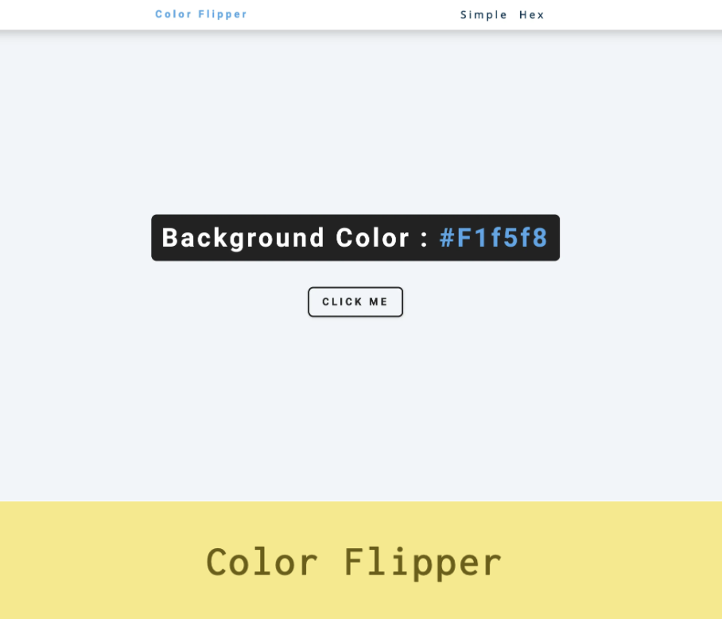

2. Counter

- Counter with increase, decrease and reset options. Changing colors when it is below or above 0.

    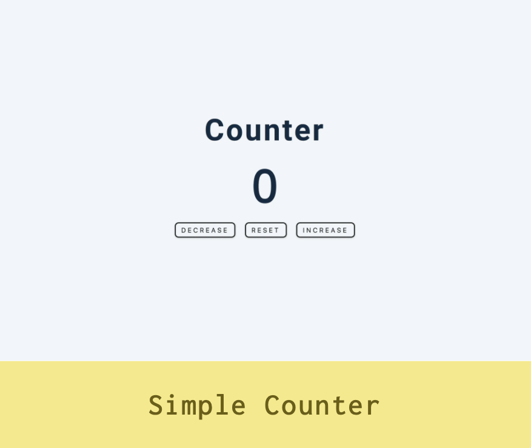

3. Reviews

- It is a review page with option to go over the reviews, back and forth
- Showing a random review

    

4. Navbar

- Navbar toggle functionality

      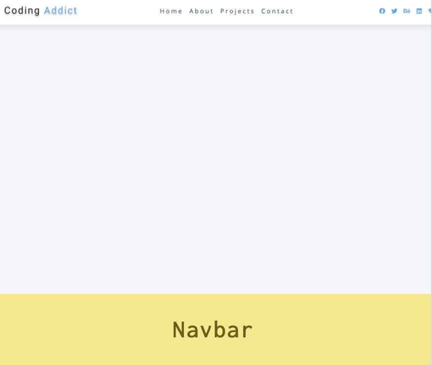
  

5. Sidebar

- Sidebar toggle functionality

    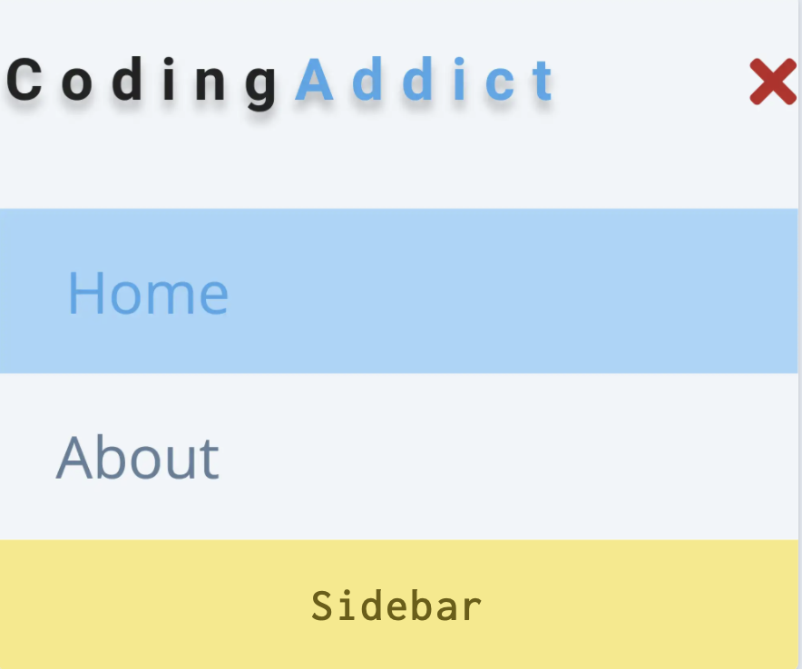

6. Modal

- We have a background image and in the center there is a banner. When we click on it, it opens up a modal with an overlay. The modal has a close button.

      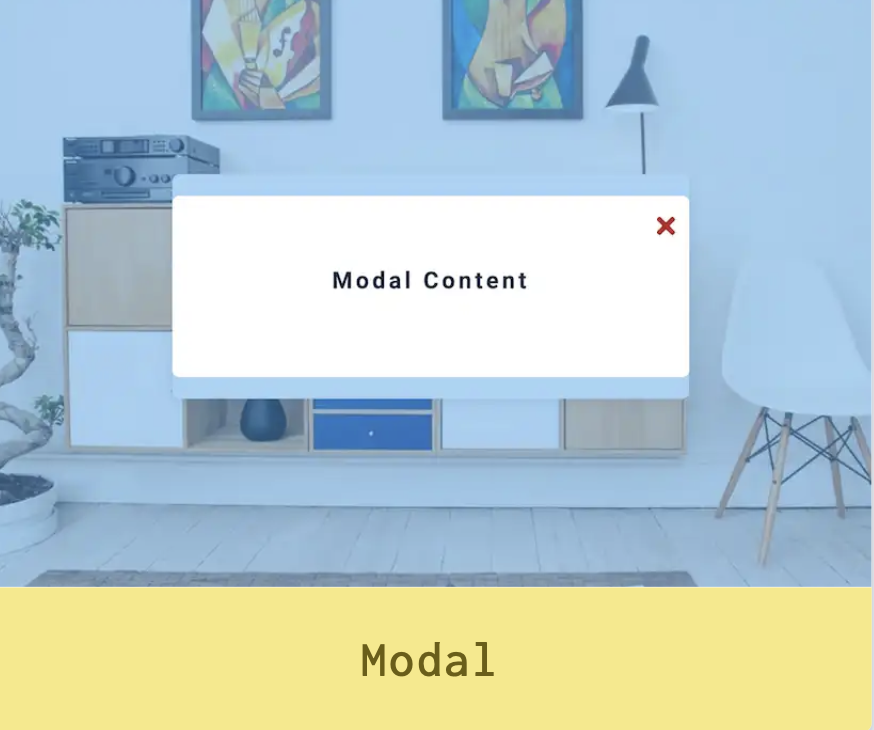
  

7. Questions

- Open/close answers functionality

      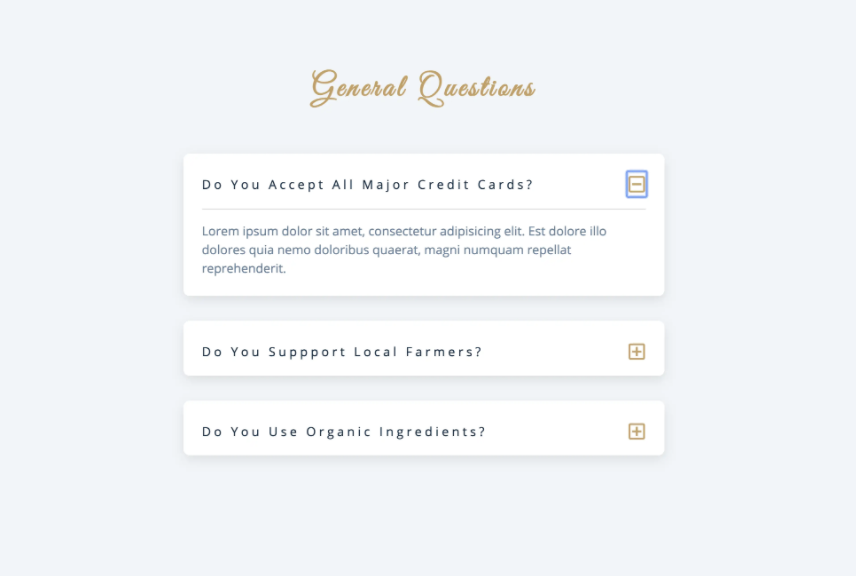
  

8. Menu

- Display items dynamically, once the page loads
- Setting up filtering options

    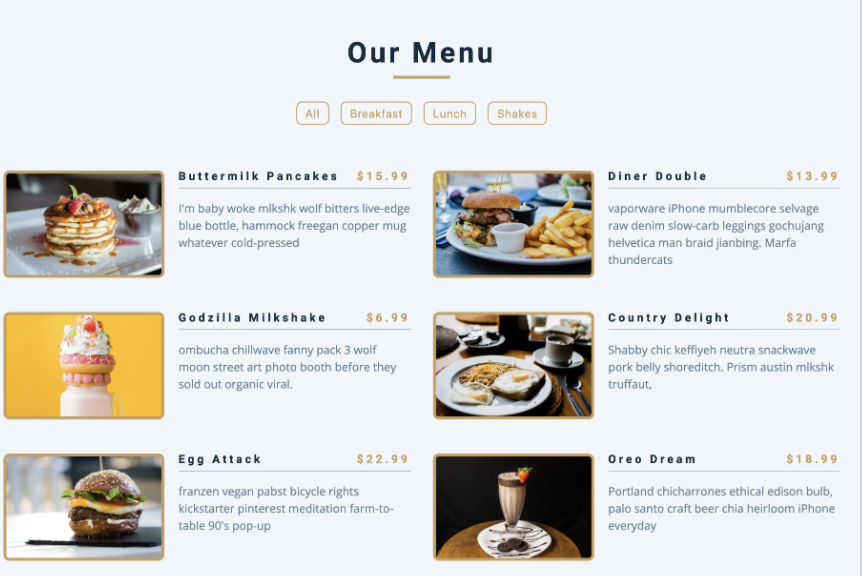

9. Video

- Adding video in the html with a overlay and a play/pouse slide button
- Adding a preloader

    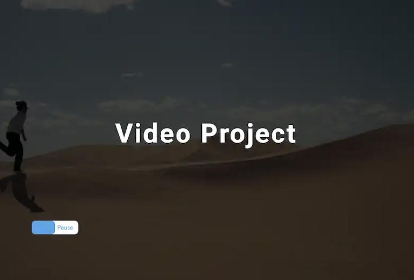

10. Scroll

- Calculate the hight of the sidebar links dynamically
- Fixed navbar. Working with scroll event
- Set up smooth scroll
- Adding 'back to the top' button
- Dynamic setup for small and big screen

    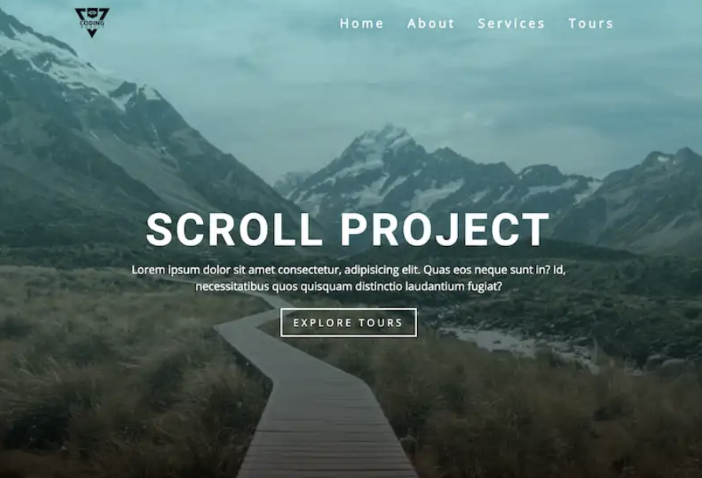

11. Tabs

- It is an about page with tabs section

    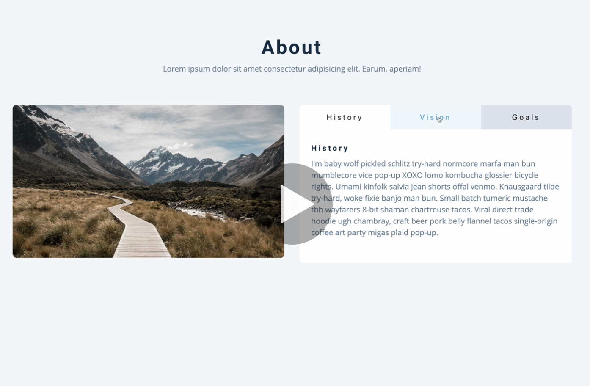

12. Countdown timer

- a

    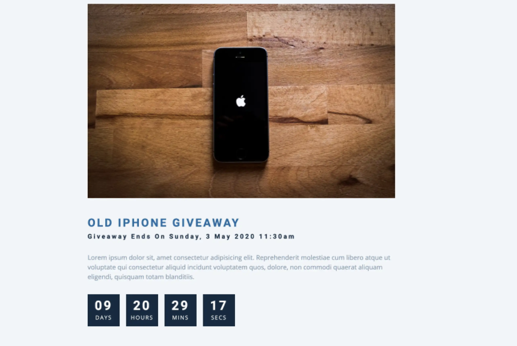

13. Lorem ipsum

- a

    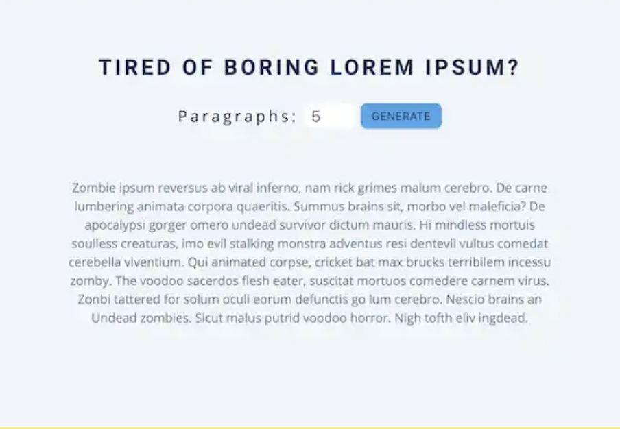

14. Grocery bud

- a

    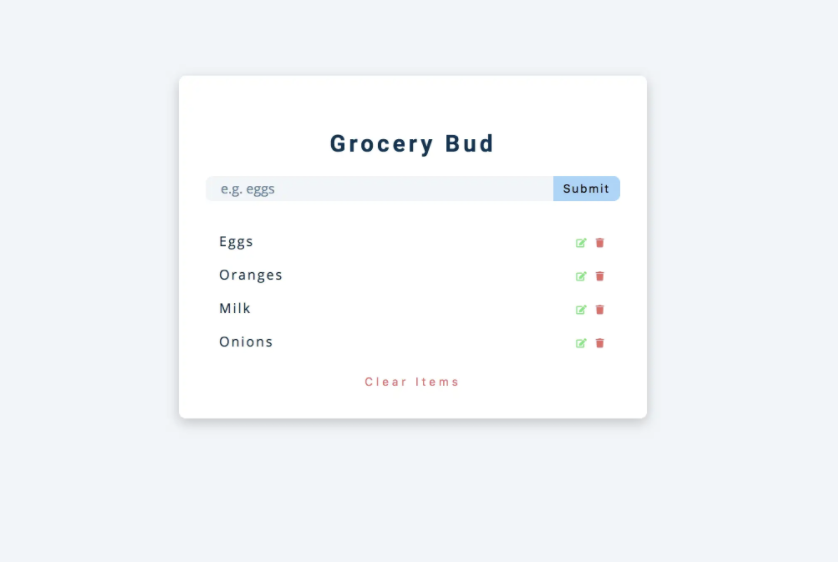

15. Slider

- a

    

