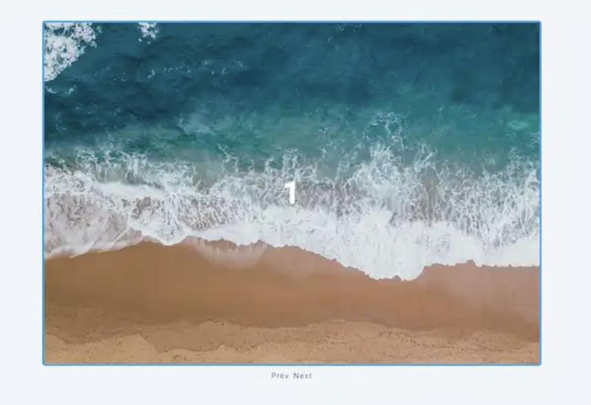

## Vanilla JS basic projects

#### Part of John Smilga's JS Tutorial

#### You can see all projects in action here

[Projects](https://www.vanillajavascriptprojects.com/)

1. Color flipper

- a

    

2.

- a

    

3.

- a

    

4.

- a

    

5.

- a

    

6.

- a

    

7.

- a

    

8.

- a

    

9.

- a

    

10.

- a

    

11.

- a

    

12.

- a

    

13.

- a

    

14.

- a

    

15.

- a

    

